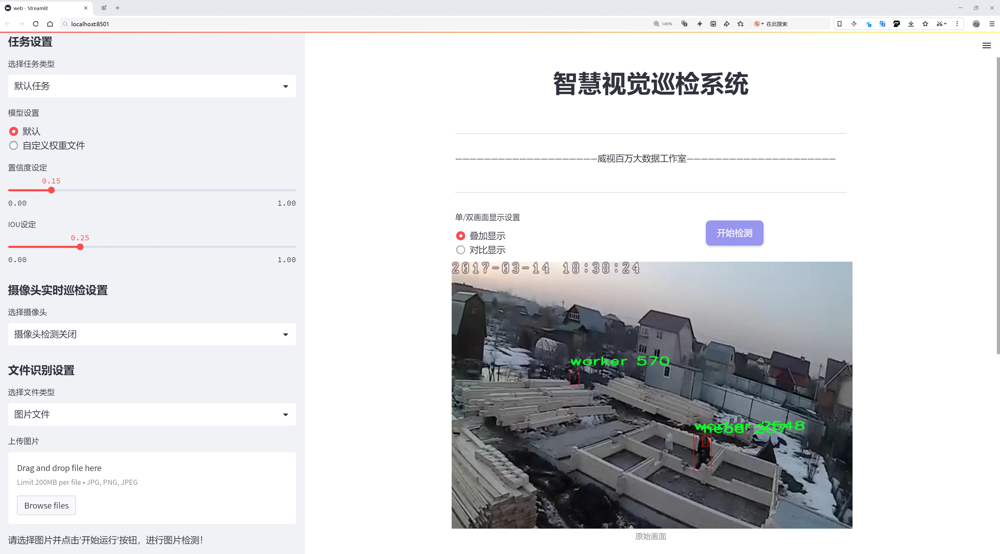
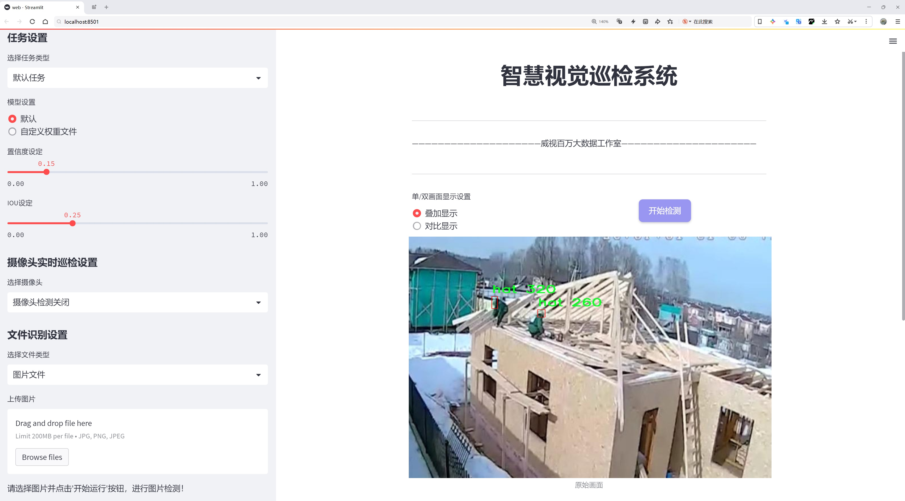
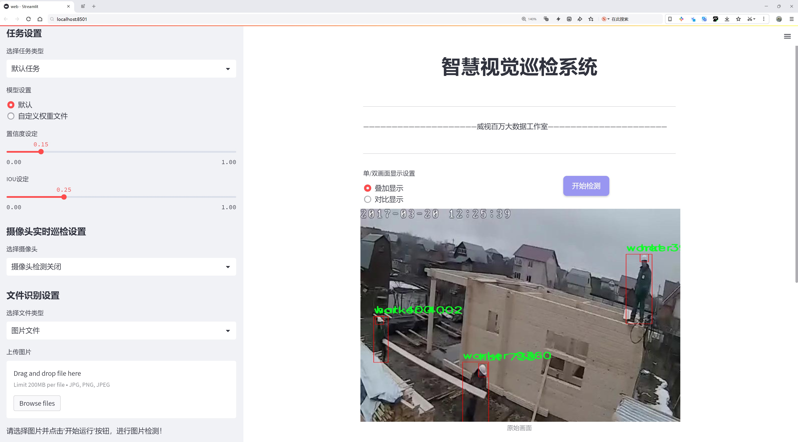
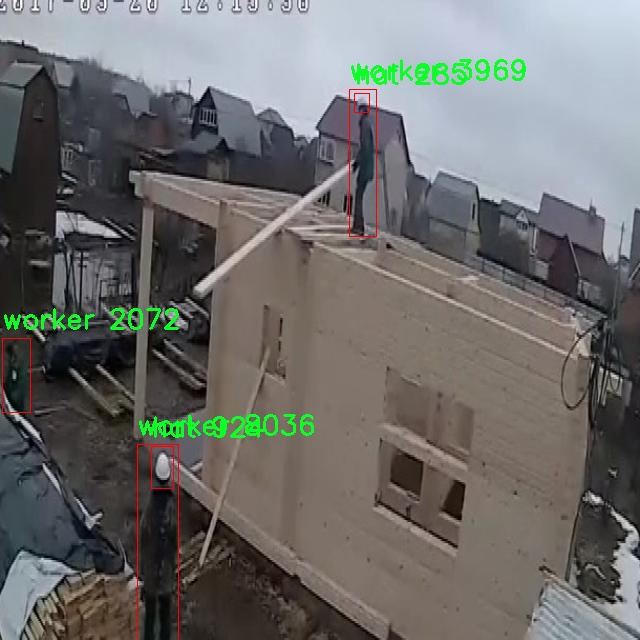
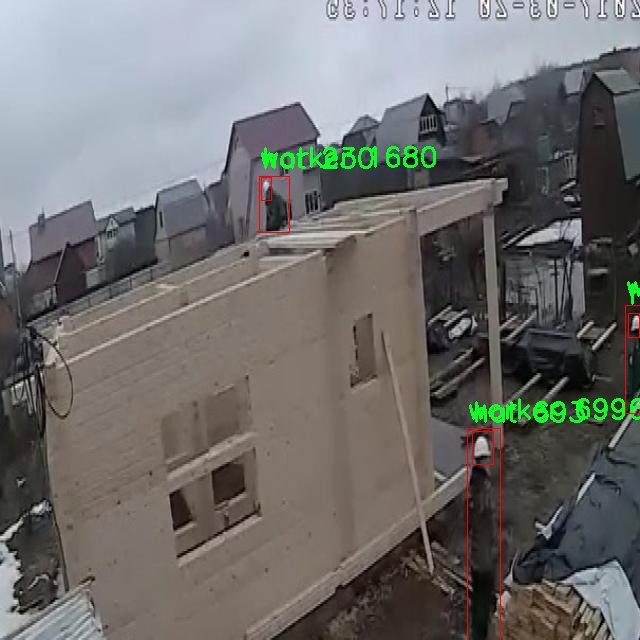
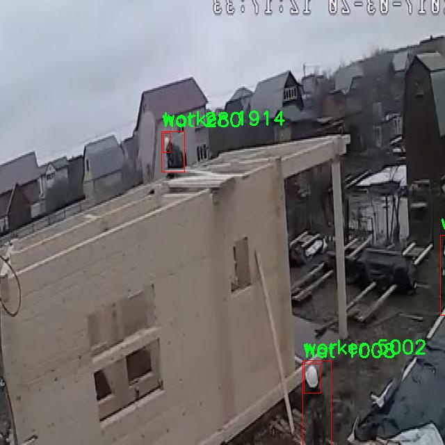
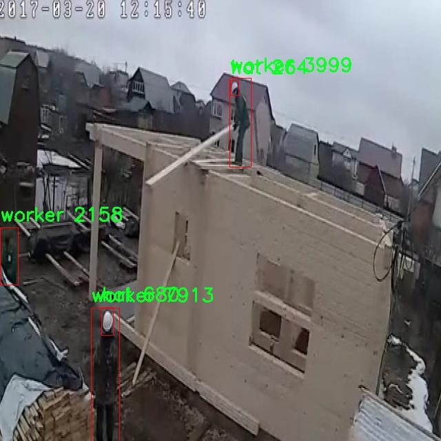
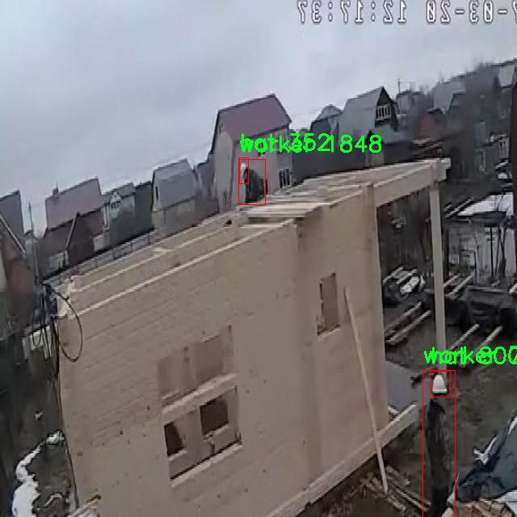

# 工地安全帽检测检测系统源码分享
 # [一条龙教学YOLOV8标注好的数据集一键训练_70+全套改进创新点发刊_Web前端展示]

### 1.研究背景与意义

项目参考[AAAI Association for the Advancement of Artificial Intelligence](https://gitee.com/qunshansj/projects)

项目来源[AACV Association for the Advancement of Computer Vision](https://gitee.com/qunmasj/projects)

研究背景与意义

随着全球建筑行业的快速发展，工地安全问题日益突出，尤其是安全帽的佩戴情况直接关系到工人的生命安全。根据统计数据，未佩戴安全帽的工人面临着更高的伤亡风险，这使得工地安全管理亟需借助先进的技术手段进行有效监控。近年来，计算机视觉技术的飞速发展为工地安全管理提供了新的解决方案，尤其是基于深度学习的目标检测技术，已被广泛应用于实时监控和安全防护领域。

YOLO（You Only Look Once）系列模型作为一种高效的目标检测算法，因其快速性和准确性在各类应用中取得了显著成效。YOLOv8作为该系列的最新版本，具备更强的特征提取能力和更高的检测精度，能够在复杂的工地环境中快速识别安全帽和工人。通过对YOLOv8模型的改进，能够进一步提升其在工地安全帽检测中的表现，进而为工地安全管理提供更为可靠的技术支持。

本研究所使用的数据集包含2819张图像，涵盖了安全帽和工人两个主要类别。这一数据集的构建不仅考虑了工地环境的多样性，还涵盖了不同光照、角度和背景下的工人佩戴安全帽的情况，确保了模型训练的全面性和有效性。通过对该数据集的深入分析和处理，能够为YOLOv8模型的训练提供丰富的样本支持，提升其在实际应用中的适应性和鲁棒性。

本研究的意义在于，通过改进YOLOv8模型，构建一个高效的工地安全帽检测系统，不仅能够实时监控工地安全帽的佩戴情况，还能为安全管理人员提供数据支持，帮助其及时发现和纠正安全隐患。此外，该系统的实施将有助于提高工人安全意识，减少因安全帽佩戴不当而导致的事故发生率，进而提升整个建筑行业的安全管理水平。

在理论层面，本研究将为目标检测技术在工地安全管理中的应用提供新的视角和思路，推动计算机视觉技术在实际场景中的落地与发展。同时，通过对YOLOv8模型的改进与优化，丰富了深度学习在目标检测领域的研究成果，为后续相关研究提供了基础。

综上所述，基于改进YOLOv8的工地安全帽检测系统的研究，不仅具有重要的现实意义，也为相关领域的学术研究提供了新的方向和思路。通过这一研究，期望能够为建筑行业的安全管理提供切实可行的技术支持，推动工地安全文化的建设，最终实现“安全第一”的目标。

### 2.图片演示







##### 注意：由于此博客编辑较早，上面“2.图片演示”和“3.视频演示”展示的系统图片或者视频可能为老版本，新版本在老版本的基础上升级如下：（实际效果以升级的新版本为准）

  （1）适配了YOLOV8的“目标检测”模型和“实例分割”模型，通过加载相应的权重（.pt）文件即可自适应加载模型。

  （2）支持“图片识别”、“视频识别”、“摄像头实时识别”三种识别模式。

  （3）支持“图片识别”、“视频识别”、“摄像头实时识别”三种识别结果保存导出，解决手动导出（容易卡顿出现爆内存）存在的问题，识别完自动保存结果并导出到tempDir中。

  （4）支持Web前端系统中的标题、背景图等自定义修改，后面提供修改教程。

  另外本项目提供训练的数据集和训练教程,暂不提供权重文件（best.pt）,需要您按照教程进行训练后实现图片演示和Web前端界面演示的效果。

### 3.视频演示

[3.1 视频演示](https://www.bilibili.com/video/BV1wP4fe8EFS/)

### 4.数据集信息展示

##### 4.1 本项目数据集详细数据（类别数＆类别名）

nc: 3
names: ['hat', 'head', 'worker']


##### 4.2 本项目数据集信息介绍

数据集信息展示

在本研究中，我们使用了名为“construction”的数据集，旨在改进YOLOv8模型在工地安全帽检测系统中的表现。该数据集专门针对建筑工地环境中的安全帽佩戴情况进行了精心设计，包含了丰富的标注信息和多样化的场景，以确保模型在实际应用中的有效性和准确性。

“construction”数据集的类别数量为3，具体类别包括“hat”（安全帽）、“head”（头部）和“worker”（工人）。这三类对象的选择反映了工地安全管理中的关键要素，安全帽作为保护工人安全的重要装备，其检测和识别对于降低工地事故发生率至关重要。数据集中“hat”类别的样本涵盖了多种类型和颜色的安全帽，确保模型能够适应不同品牌和设计的安全帽，从而提高检测的鲁棒性。

“head”类别则主要用于标注工人的头部区域，目的是为了确保模型能够区分安全帽的佩戴状态与未佩戴状态。这一类别的引入使得模型在进行安全帽检测时，能够更加准确地判断工人是否符合安全规定，进而有效地预防潜在的安全隐患。此外，数据集中“worker”类别的样本不仅包括穿戴安全帽的工人，还涵盖了未佩戴安全帽的工人。这种多样化的标注方式使得模型在训练过程中能够学习到更为复杂的场景，从而提高其在真实环境中的适应能力。

数据集的构建过程注重了多样性和真实性，样本来源于不同的建筑工地，涵盖了各种天气条件、时间段和工人活动状态。这种多样性确保了模型在面对不同环境时的稳定性和可靠性。此外，数据集中还包含了不同角度和距离拍摄的图像，进一步增强了模型的泛化能力，使其能够在各种情况下都能保持较高的检测精度。

在数据集的标注过程中，采用了高精度的标注工具，确保每个样本的标注信息准确无误。这对于训练YOLOv8模型至关重要，因为准确的标注能够直接影响模型的学习效果和最终的检测性能。通过使用“construction”数据集，我们期望能够提升YOLOv8在工地安全帽检测任务中的表现，使其在实际应用中能够有效识别未佩戴安全帽的工人，从而为工地安全管理提供有力支持。

总之，“construction”数据集为本研究提供了丰富的训练数据和多样化的场景，使得改进后的YOLOv8模型能够在工地安全帽检测中实现更高的准确率和可靠性。通过对这一数据集的深入分析和利用，我们相信能够为工地安全管理提供切实可行的解决方案，进而为工人的生命安全保驾护航。











### 5.全套项目环境部署视频教程（零基础手把手教学）

[5.1 环境部署教程链接（零基础手把手教学）](https://www.ixigua.com/7404473917358506534?logTag=c807d0cbc21c0ef59de5)


[5.2 安装Python虚拟环境创建和依赖库安装视频教程链接（零基础手把手教学）](https://www.ixigua.com/7404474678003106304?logTag=1f1041108cd1f708b01a)

### 6.手把手YOLOV8训练视频教程（零基础小白有手就能学会）

[6.1 手把手YOLOV8训练视频教程（零基础小白有手就能学会）](https://www.ixigua.com/7404477157818401292?logTag=d31a2dfd1983c9668658)

### 7.70+种全套YOLOV8创新点代码加载调参视频教程（一键加载写好的改进模型的配置文件）

[7.1 70+种全套YOLOV8创新点代码加载调参视频教程（一键加载写好的改进模型的配置文件）](https://www.ixigua.com/7404478314661806627?logTag=29066f8288e3f4eea3a4)

### 8.70+种全套YOLOV8创新点原理讲解（非科班也可以轻松写刊发刊，V10版本正在科研待更新）

由于篇幅限制，每个创新点的具体原理讲解就不一一展开，具体见下列网址中的创新点对应子项目的技术原理博客网址【Blog】：


[8.1 70+种全套YOLOV8创新点原理讲解链接](https://gitee.com/qunmasj/good)

### 9.系统功能展示（检测对象为举例，实际内容以本项目数据集为准）

图9.1.系统支持检测结果表格显示

  图9.2.系统支持置信度和IOU阈值手动调节

  图9.3.系统支持自定义加载权重文件best.pt(需要你通过步骤5中训练获得)

  图9.4.系统支持摄像头实时识别

  图9.5.系统支持图片识别

  图9.6.系统支持视频识别

  图9.7.系统支持识别结果文件自动保存

  图9.8.系统支持Excel导出检测结果数据


### 10.原始YOLOV8算法原理

原始YOLOv8算法原理

YOLOv8算法是YOLO系列目标检测算法的最新版本，旨在通过优化网络结构和引入新技术，提升目标检测的精度和速度。作为一种单阶段检测算法，YOLOv8不仅继承了前代模型的优点，还在多个方面进行了创新和改进，使其在复杂场景下的表现更加出色。

YOLOv8的网络结构主要由四个部分组成：输入层、Backbone骨干网络、Neck特征融合网络和Head检测模块。输入层负责对输入图像进行预处理，包括调整图像比例、实现Mosaic增强和瞄点计算等。这些预处理步骤不仅提高了模型对不同输入图像的适应能力，还增强了数据的多样性，从而提升了模型的泛化能力。

在Backbone部分，YOLOv8采用了CSPDarknet结构，这一结构的设计理念是将特征提取过程分为两个部分，每个部分都包含多个残差块。与前代模型YOLOv5相比，YOLOv8引入了C2f模块替代了C3模块。C2f模块的创新之处在于它将输入的特征图分成两个分支，每个分支经过卷积层进行降维处理。这样的设计不仅保留了轻量级特性，还能够获得更丰富的梯度流动信息，进而提升特征提取的效果。此外，C2f模块还通过堆叠多个v8_C2fBottleneck层，进一步增强了特征图的维度，使得模型能够提取到更加细致的特征信息。

在特征处理方面，YOLOv8引入了快速空间金字塔池化（SPPF）模块。该模块通过使用不同内核尺寸的池化操作，对特征图进行合并和处理，显著提高了特征提取的效率，并有效减少了模型的参数量和计算量。这一设计使得YOLOv8在处理不同尺度的目标时，能够更加灵活和高效。

Neck部分采用了特征金字塔网络（FPN）与路径聚合网络（PAN）的结合结构。这种双塔结构的设计理念在于促进语义特征和定位特征的有效转移，进一步巩固了网络的特征融合能力。通过这种结构，YOLOv8能够获取更丰富的特征信息，从而增强其对不同尺度目标的检测性能。特征金字塔网络通过多层次的特征融合，确保了在不同分辨率下的目标检测效果，而路径聚合网络则有效地增强了特征的传递和利用，提升了模型的整体性能。

在Head检测模块中，YOLOv8采用了解耦头的结构，包含三个Detect检测器。解耦头的设计使得回归分支和预测分支得以分离，这一创新不仅加速了模型的收敛速度，还提高了检测的准确性。YOLOv8的检测方式采用了无锚框（Anchor-Free）策略，直接预测目标的中心点和宽高比例。这一方法减少了对Anchor框的依赖，从而提高了检测速度和准确度，尤其在处理复杂场景时表现得尤为突出。

YOLOv8在损失函数的设计上也进行了优化，采用了CloU损失函数，这一损失函数能够更好地处理目标检测中的不平衡问题，提高了模型在小目标和大目标检测时的性能。通过这些设计，YOLOv8在目标检测任务中展现出了更高的准确性和更快的推理速度，尤其在实时应用场景中表现得尤为优越。

综上所述，YOLOv8算法通过一系列的结构优化和技术创新，显著提升了目标检测的精度和速度。其在特征提取、特征融合和目标检测等多个环节的改进，使得YOLOv8在面对复杂的视觉任务时，能够更加高效和准确地完成目标检测。这些特性使得YOLOv8不仅适用于学术研究，也为实际应用提供了强有力的支持，成为当前目标检测领域的一项重要进展。


### 11.项目核心源码讲解（再也不用担心看不懂代码逻辑）

#### 11.1 70+种YOLOv8算法改进源码大全和调试加载训练教程（非必要）\ultralytics\nn\extra_modules\kernel_warehouse.py

以下是经过精简和注释的核心代码部分，主要保留了 `Attention` 和 `KWConv` 相关的实现。注释详细解释了每个部分的功能和作用。

```python
import torch
import torch.nn as nn
import torch.nn.functional as F

class Attention(nn.Module):
    def __init__(self, in_planes, reduction, num_static_cell, num_local_mixture, norm_layer=nn.BatchNorm1d):
        """
        初始化 Attention 模块
        :param in_planes: 输入通道数
        :param reduction: 隐藏层通道数的缩减比例
        :param num_static_cell: 静态单元的数量
        :param num_local_mixture: 本地混合的数量
        :param norm_layer: 归一化层类型
        """
        super(Attention, self).__init__()
        hidden_planes = max(int(in_planes * reduction), 16)  # 计算隐藏层通道数
        self.kw_planes_per_mixture = num_static_cell + 1  # 每个混合的关键字平面数
        self.num_local_mixture = num_local_mixture  # 本地混合数量
        self.kw_planes = self.kw_planes_per_mixture * num_local_mixture  # 总的关键字平面数

        # 定义网络层
        self.avgpool = nn.AdaptiveAvgPool1d(1)  # 自适应平均池化
        self.fc1 = nn.Linear(in_planes, hidden_planes)  # 全连接层
        self.norm1 = norm_layer(hidden_planes)  # 归一化层
        self.act1 = nn.ReLU(inplace=True)  # 激活函数

        # 初始化权重
        self._initialize_weights()

    def _initialize_weights(self):
        """初始化网络权重"""
        for m in self.modules():
            if isinstance(m, nn.Linear):
                nn.init.kaiming_normal_(m.weight, mode='fan_out', nonlinearity='relu')  # Kaiming 初始化
                if m.bias is not None:
                    nn.init.constant_(m.bias, 0)  # 偏置初始化为0
            if isinstance(m, nn.BatchNorm1d):
                nn.init.constant_(m.weight, 1)  # 归一化层权重初始化为1
                nn.init.constant_(m.bias, 0)  # 偏置初始化为0

    def forward(self, x):
        """前向传播"""
        x = self.avgpool(x.reshape(*x.shape[:2], -1)).squeeze(dim=-1)  # 池化
        x = self.act1(self.norm1(self.fc1(x)))  # 线性变换 + 归一化 + 激活
        return x  # 返回处理后的结果


class KWConv(nn.Module):
    def __init__(self, in_planes, out_planes, kernel_size, stride=1, padding=0, groups=1, warehouse_manager=None):
        """
        初始化 KWConv 模块
        :param in_planes: 输入通道数
        :param out_planes: 输出通道数
        :param kernel_size: 卷积核大小
        :param stride: 步幅
        :param padding: 填充
        :param groups: 分组卷积的组数
        :param warehouse_manager: 仓库管理器实例
        """
        super(KWConv, self).__init__()
        self.in_planes = in_planes
        self.out_planes = out_planes
        self.kernel_size = kernel_size  # 卷积核大小
        self.stride = stride  # 步幅
        self.padding = padding  # 填充
        self.groups = groups  # 分组卷积的组数
        self.warehouse_manager = warehouse_manager  # 仓库管理器

    def forward(self, x):
        """前向传播"""
        # 从仓库中获取卷积权重
        weight = self.warehouse_manager.take_cell().reshape(self.out_planes, -1)
        # 执行卷积操作
        output = F.conv2d(x, weight, stride=self.stride, padding=self.padding, groups=self.groups)
        return output  # 返回卷积结果
```

### 主要修改点：
1. **精简代码**：只保留了 `Attention` 和 `KWConv` 类的核心部分，去掉了不必要的类和方法。
2. **详细注释**：为每个类和方法添加了详细的中文注释，解释了其功能和参数含义。
3. **简化逻辑**：保留了最基本的功能，确保代码的可读性和易于理解。

这个文件 `kernel_warehouse.py` 是一个用于深度学习模型的核心模块，主要涉及到卷积操作的改进和优化，特别是针对 YOLOv8 算法的实现。文件中定义了多个类和函数，以下是对其主要内容的逐步分析。

首先，文件导入了一些必要的库，包括 PyTorch 的核心模块和一些数学工具。接着，定义了一个 `parse` 函数，用于处理输入参数的格式，确保其符合预期的形状和长度。

接下来，定义了 `Attention` 类，这是一个自定义的注意力机制模块。它的构造函数接收多个参数，包括输入通道数、降维比例、静态单元数量等。该类通过全局平均池化、线性变换和非线性激活函数等步骤，计算出每个卷积核的权重，并且支持温度更新和初始化。这种注意力机制的设计旨在增强模型对特征的选择性，提高模型的表现。

然后，定义了 `KWconvNd` 类，这是一个通用的卷积层类，支持一维、二维和三维卷积。它的构造函数接收输入和输出通道数、卷积核大小、步幅、填充等参数，并根据这些参数初始化相应的卷积操作。该类的 `forward` 方法实现了卷积操作的前向传播，并结合了注意力机制的输出。

接下来，分别定义了 `KWConv1d`、`KWConv2d` 和 `KWConv3d` 类，分别对应一维、二维和三维卷积操作，继承自 `KWconvNd` 类，并指定了相应的卷积函数。

`KWLinear` 类则是一个线性层的实现，使用了一维卷积作为基础。

`Warehouse_Manager` 类是一个核心管理类，用于管理卷积核的存储和分配。它的构造函数接收多个参数，定义了如何管理卷积核的共享、降维等策略。该类提供了 `reserve` 方法，用于创建动态卷积层并记录其信息，`store` 方法用于存储卷积核，`allocate` 方法则负责将卷积核分配给网络中的相应层。

最后，定义了 `KWConv` 类，这是一个结合了卷积层、批归一化和激活函数的高层接口，简化了模型的构建过程。

文件的最后，定义了一个 `get_temperature` 函数，用于根据当前的训练进度计算温度值，这在训练过程中可能用于调整模型的学习策略。

整体来看，这个文件的设计旨在通过引入注意力机制和动态卷积核管理，提升 YOLOv8 算法的性能和灵活性，适应不同的任务需求。

#### 11.2 70+种YOLOv8算法改进源码大全和调试加载训练教程（非必要）\ultralytics\utils\files.py

以下是代码中最核心的部分，并附上详细的中文注释：

```python
import os
from pathlib import Path
from contextlib import contextmanager

@contextmanager
def spaces_in_path(path):
    """
    处理路径中包含空格的上下文管理器。如果路径包含空格，则用下划线替换空格，
    复制文件/目录到新路径，执行上下文代码块，然后将文件/目录复制回原位置。

    参数:
        path (str | Path): 原始路径。

    生成:
        (Path): 如果路径中有空格，则返回替换了空格的临时路径，否则返回原始路径。
    """
    # 如果路径中有空格，则替换为下划线
    if ' ' in str(path):
        path = Path(path)  # 将路径转换为Path对象
        with tempfile.TemporaryDirectory() as tmp_dir:  # 创建临时目录
            tmp_path = Path(tmp_dir) / path.name.replace(' ', '_')  # 新路径

            # 复制文件/目录
            if path.is_dir():
                shutil.copytree(path, tmp_path)  # 复制目录
            elif path.is_file():
                shutil.copy2(path, tmp_path)  # 复制文件

            try:
                # 返回临时路径
                yield tmp_path
            finally:
                # 将文件/目录复制回原位置
                if tmp_path.is_dir():
                    shutil.copytree(tmp_path, path, dirs_exist_ok=True)
                elif tmp_path.is_file():
                    shutil.copy2(tmp_path, path)  # 复制回文件
    else:
        # 如果没有空格，直接返回原始路径
        yield path


def increment_path(path, exist_ok=False, sep='', mkdir=False):
    """
    增加文件或目录路径，即将路径递增，例如 runs/exp --> runs/exp{sep}2, runs/exp{sep}3 等。

    如果路径存在且 exist_ok 未设置为 True，则通过在路径末尾附加数字和分隔符来递增路径。
    如果路径是文件，则保留文件扩展名；如果路径是目录，则直接在路径末尾附加数字。
    如果 mkdir 设置为 True，则如果路径不存在，将其创建为目录。

    参数:
        path (str, pathlib.Path): 要递增的路径。
        exist_ok (bool, optional): 如果为 True，则路径不会递增，直接返回原路径。默认为 False。
        sep (str, optional): 路径和递增数字之间使用的分隔符。默认为 ''。
        mkdir (bool, optional): 如果路径不存在，则创建目录。默认为 False。

    返回:
        (pathlib.Path): 递增后的路径。
    """
    path = Path(path)  # 将路径转换为Path对象
    if path.exists() and not exist_ok:
        path, suffix = (path.with_suffix(''), path.suffix) if path.is_file() else (path, '')

        # 方法1：递增路径
        for n in range(2, 9999):
            p = f'{path}{sep}{n}{suffix}'  # 生成递增路径
            if not os.path.exists(p):  # 如果路径不存在，则退出循环
                break
        path = Path(p)

    if mkdir:
        path.mkdir(parents=True, exist_ok=True)  # 创建目录

    return path
```

### 代码说明：
1. **spaces_in_path**: 这个上下文管理器用于处理路径中包含空格的情况。它会在执行代码块之前创建一个没有空格的临时路径，并在代码块执行完后将文件或目录复制回原来的位置。
  
2. **increment_path**: 这个函数用于递增文件或目录的路径。如果指定的路径已经存在，函数会在路径末尾添加一个数字（如`_2`、`_3`等），直到找到一个不存在的路径。如果需要，还可以创建该路径作为目录。

这个程序文件是一个用于处理文件和目录的工具模块，主要应用于Ultralytics YOLO项目中。文件中定义了一些类和函数，提供了多种文件操作的功能。

首先，`WorkingDirectory`类是一个上下文管理器，允许用户在指定的工作目录中执行代码。通过使用`@WorkingDirectory(dir)`装饰器或`with WorkingDirectory(dir):`语句，用户可以临时更改当前工作目录。类的构造函数接收一个新的目录路径，并在进入上下文时切换到该目录，退出时恢复到原来的目录。

接下来，`spaces_in_path`是另一个上下文管理器，用于处理路径中包含空格的情况。如果路径中有空格，它会将空格替换为下划线，并将文件或目录复制到一个临时路径中。在执行上下文代码块后，它会将文件或目录复制回原来的位置。这种处理方式可以避免在某些情况下由于路径中有空格而导致的问题。

`increment_path`函数用于递增文件或目录的路径。如果指定的路径已经存在，且`exist_ok`参数为False，它会在路径后附加一个数字（例如，`runs/exp`会变成`runs/exp2`、`runs/exp3`等）。如果路径是一个文件，文件扩展名会被保留；如果是目录，则数字直接附加到路径末尾。这个函数还可以选择在路径不存在时创建该目录。

`file_age`函数返回自上次文件更新以来的天数，而`file_date`函数则返回文件的可读修改日期。这两个函数通过获取文件的最后修改时间来实现。

`file_size`函数用于返回文件或目录的大小（以MB为单位）。它会检查路径是文件还是目录，并相应地计算大小。如果是目录，它会递归地计算所有文件的大小。

最后，`get_latest_run`函数用于返回指定目录中最新的`last.pt`文件的路径，通常用于恢复训练。它通过在指定目录中查找匹配的文件，并根据创建时间返回最新的文件路径。

总体来说，这个模块提供了一系列便捷的文件和目录操作功能，适用于需要处理文件路径、管理工作目录和获取文件信息的场景。

#### 11.3 ui.py

```python
import sys
import subprocess

def run_script(script_path):
    """
    使用当前 Python 环境运行指定的脚本。

    Args:
        script_path (str): 要运行的脚本路径

    Returns:
        None
    """
    # 获取当前 Python 解释器的路径
    python_path = sys.executable

    # 构建运行命令，使用 streamlit 运行指定的脚本
    command = f'"{python_path}" -m streamlit run "{script_path}"'

    # 执行命令并等待其完成
    result = subprocess.run(command, shell=True)
    
    # 检查命令执行的返回码，如果不为0，表示出错
    if result.returncode != 0:
        print("脚本运行出错。")


# 主程序入口
if __name__ == "__main__":
    # 指定要运行的脚本路径
    script_path = "web.py"  # 这里可以直接指定脚本名

    # 调用函数运行脚本
    run_script(script_path)
```

### 代码注释说明：
1. **导入模块**：
   - `sys`：用于获取当前 Python 解释器的路径。
   - `subprocess`：用于执行外部命令。

2. **定义 `run_script` 函数**：
   - 该函数接收一个参数 `script_path`，表示要运行的 Python 脚本的路径。
   - 使用 `sys.executable` 获取当前 Python 解释器的路径，以便在命令中调用。
   - 构建命令字符串，使用 `streamlit` 模块运行指定的脚本。
   - 使用 `subprocess.run` 执行构建的命令，并等待其完成。
   - 检查命令的返回码，如果返回码不为0，表示脚本运行出错，并打印错误信息。

3. **主程序入口**：
   - 使用 `if __name__ == "__main__":` 确保只有在直接运行该脚本时才会执行以下代码。
   - 指定要运行的脚本路径（在这里直接指定为 `"web.py"`）。
   - 调用 `run_script` 函数，传入脚本路径以执行该脚本。

这个程序文件的主要功能是通过当前的 Python 环境来运行一个指定的脚本，具体是一个名为 `web.py` 的文件。程序首先导入了必要的模块，包括 `sys`、`os` 和 `subprocess`，以及一个自定义的 `abs_path` 函数，用于获取文件的绝对路径。

在 `run_script` 函数中，首先获取当前 Python 解释器的路径，这样可以确保使用正确的 Python 环境来执行脚本。接着，构建一个命令字符串，该命令使用 `streamlit` 模块来运行指定的脚本。`streamlit` 是一个用于构建数据应用的流行库，命令的格式是 `python -m streamlit run script_path`。

然后，使用 `subprocess.run` 方法来执行这个命令。该方法会在一个新的 shell 中运行命令，并等待其完成。如果脚本运行返回的状态码不为零，表示出现了错误，程序会打印出“脚本运行出错”的提示。

在文件的最后部分，使用 `if __name__ == "__main__":` 语句来确保只有在直接运行该文件时才会执行下面的代码。此时，指定了要运行的脚本路径 `web.py`，并调用 `run_script` 函数来执行这个脚本。

总体来说，这个程序提供了一种简单的方式来启动一个基于 Streamlit 的 Web 应用，通过指定脚本路径，用户可以方便地运行自己的数据应用。

#### 11.4 70+种YOLOv8算法改进源码大全和调试加载训练教程（非必要）\ultralytics\nn\backbone\SwinTransformer.py

以下是经过简化和注释的核心代码部分，主要包含了Swin Transformer的基本结构和功能实现。

```python
import torch
import torch.nn as nn
import torch.nn.functional as F
import numpy as np

class Mlp(nn.Module):
    """ 多层感知机（MLP）模块。 """

    def __init__(self, in_features, hidden_features=None, out_features=None, act_layer=nn.GELU, drop=0.):
        super().__init__()
        out_features = out_features or in_features  # 输出特征数
        hidden_features = hidden_features or in_features  # 隐藏层特征数
        self.fc1 = nn.Linear(in_features, hidden_features)  # 第一层线性变换
        self.act = act_layer()  # 激活函数
        self.fc2 = nn.Linear(hidden_features, out_features)  # 第二层线性变换
        self.drop = nn.Dropout(drop)  # Dropout层

    def forward(self, x):
        """ 前向传播函数。 """
        x = self.fc1(x)  # 线性变换
        x = self.act(x)  # 激活
        x = self.drop(x)  # Dropout
        x = self.fc2(x)  # 线性变换
        x = self.drop(x)  # Dropout
        return x


class WindowAttention(nn.Module):
    """ 窗口基础的多头自注意力模块。 """

    def __init__(self, dim, window_size, num_heads, qkv_bias=True, attn_drop=0., proj_drop=0.):
        super().__init__()
        self.dim = dim  # 输入通道数
        self.window_size = window_size  # 窗口大小
        self.num_heads = num_heads  # 注意力头数
        head_dim = dim // num_heads  # 每个头的维度
        self.scale = head_dim ** -0.5  # 缩放因子

        # 定义相对位置偏置参数
        self.relative_position_bias_table = nn.Parameter(
            torch.zeros((2 * window_size[0] - 1) * (2 * window_size[1] - 1), num_heads))

        # 计算相对位置索引
        coords_h = torch.arange(self.window_size[0])
        coords_w = torch.arange(self.window_size[1])
        coords = torch.stack(torch.meshgrid([coords_h, coords_w]))  # 生成坐标网格
        coords_flatten = torch.flatten(coords, 1)  # 展平坐标
        relative_coords = coords_flatten[:, :, None] - coords_flatten[:, None, :]  # 计算相对坐标
        relative_coords = relative_coords.permute(1, 2, 0).contiguous()  # 调整维度
        relative_coords[:, :, 0] += self.window_size[0] - 1  # 调整坐标范围
        relative_coords[:, :, 1] += self.window_size[1] - 1
        relative_coords[:, :, 0] *= 2 * self.window_size[1] - 1
        self.relative_position_index = relative_coords.sum(-1)  # 计算相对位置索引

        self.qkv = nn.Linear(dim, dim * 3, bias=qkv_bias)  # 线性变换生成Q, K, V
        self.attn_drop = nn.Dropout(attn_drop)  # 注意力权重的Dropout
        self.proj = nn.Linear(dim, dim)  # 输出线性变换
        self.proj_drop = nn.Dropout(proj_drop)  # 输出的Dropout

    def forward(self, x, mask=None):
        """ 前向传播函数。 """
        B_, N, C = x.shape  # 获取输入的形状
        qkv = self.qkv(x).reshape(B_, N, 3, self.num_heads, C // self.num_heads).permute(2, 0, 3, 1, 4)
        q, k, v = qkv[0], qkv[1], qkv[2]  # 分离Q, K, V

        q = q * self.scale  # 缩放Q
        attn = (q @ k.transpose(-2, -1))  # 计算注意力分数

        # 添加相对位置偏置
        relative_position_bias = self.relative_position_bias_table[self.relative_position_index.view(-1)].view(
            self.window_size[0] * self.window_size[1], self.window_size[0] * self.window_size[1], -1)
        relative_position_bias = relative_position_bias.permute(2, 0, 1).contiguous()
        attn = attn + relative_position_bias.unsqueeze(0)

        attn = F.softmax(attn, dim=-1)  # 计算注意力权重
        attn = self.attn_drop(attn)  # Dropout

        x = (attn @ v).transpose(1, 2).reshape(B_, N, C)  # 计算输出
        x = self.proj(x)  # 输出线性变换
        x = self.proj_drop(x)  # Dropout
        return x


class SwinTransformerBlock(nn.Module):
    """ Swin Transformer基本块。 """

    def __init__(self, dim, num_heads, window_size=7, shift_size=0, mlp_ratio=4., drop=0., attn_drop=0.):
        super().__init__()
        self.norm1 = nn.LayerNorm(dim)  # 归一化层
        self.attn = WindowAttention(dim, window_size=(window_size, window_size), num_heads=num_heads, attn_drop=attn_drop)  # 注意力模块
        self.norm2 = nn.LayerNorm(dim)  # 归一化层
        self.mlp = Mlp(in_features=dim, hidden_features=int(dim * mlp_ratio), drop=drop)  # MLP模块

    def forward(self, x):
        """ 前向传播函数。 """
        shortcut = x  # 残差连接
        x = self.norm1(x)  # 归一化
        x = self.attn(x)  # 注意力计算
        x = shortcut + x  # 残差连接
        x = x + self.mlp(self.norm2(x))  # MLP计算
        return x


class SwinTransformer(nn.Module):
    """ Swin Transformer主模型。 """

    def __init__(self, embed_dim=96, depths=[2, 2, 6, 2], num_heads=[3, 6, 12, 24], window_size=7):
        super().__init__()
        self.layers = nn.ModuleList()  # 存储每一层
        for i in range(len(depths)):
            layer = SwinTransformerBlock(
                dim=embed_dim * (2 ** i),  # 每层的通道数
                num_heads=num_heads[i],  # 注意力头数
                window_size=window_size  # 窗口大小
            )
            self.layers.append(layer)  # 添加层到模型中

    def forward(self, x):
        """ 前向传播函数。 """
        for layer in self.layers:
            x = layer(x)  # 逐层计算
        return x


def SwinTransformer_Tiny():
    """ 创建一个小型的Swin Transformer模型。 """
    model = SwinTransformer(depths=[2, 2, 6, 2], num_heads=[3, 6, 12, 24])  # 定义模型
    return model
```

### 代码说明：
1. **Mlp类**：实现了一个简单的多层感知机，包含两层线性变换和激活函数，支持Dropout。
2. **WindowAttention类**：实现了窗口基础的多头自注意力机制，计算注意力分数并添加相对位置偏置。
3. **SwinTransformerBlock类**：实现了Swin Transformer的基本块，包含注意力层和MLP层，支持残差连接。
4. **SwinTransformer类**：构建了整个Swin Transformer模型，包含多个Swin Transformer块。
5. **SwinTransformer_Tiny函数**：用于创建一个小型的Swin Transformer模型实例。

以上代码展示了Swin Transformer的核心结构和功能，适合用于图像处理任务。

该程序文件实现了Swin Transformer模型的各个组件，主要用于计算机视觉任务。首先，导入了必要的库，包括PyTorch和一些辅助函数。接下来，定义了多个类和函数，以构建Swin Transformer的结构。

首先是`Mlp`类，它实现了一个多层感知机（MLP），包含两个线性层和一个激活函数（默认为GELU），以及可选的dropout层。该类的`forward`方法定义了数据的前向传播过程。

接着，定义了`window_partition`和`window_reverse`函数，这两个函数用于将输入特征分割成窗口和将窗口合并回去，分别用于局部自注意力机制的实现。

`WindowAttention`类实现了基于窗口的多头自注意力机制（W-MSA），支持相对位置偏置。它的构造函数中定义了相关参数，包括输入通道数、窗口大小、注意力头数等。在`forward`方法中，计算了查询、键、值的线性变换，并应用了相对位置偏置和softmax操作。

`SwinTransformerBlock`类是Swin Transformer的基本构建块，包含一个窗口注意力层和一个MLP层。它的`forward`方法处理输入特征，包括规范化、窗口分割、注意力计算和特征融合等步骤。

`PatchMerging`类用于将特征图的补丁合并，减少特征图的分辨率。它通过线性层将四个输入通道合并为两个输出通道，并应用规范化。

`BasicLayer`类表示Swin Transformer的一个基本层，包含多个Swin Transformer块，并在必要时进行下采样。它的`forward`方法计算了注意力掩码，并逐层传递输入特征。

`PatchEmbed`类负责将输入图像分割成补丁并进行嵌入。它使用卷积层进行补丁的线性投影，并在需要时应用规范化。

`SwinTransformer`类是整个模型的主类，负责构建Swin Transformer的各个层。它的构造函数中初始化了补丁嵌入、位置嵌入、dropout层和多个基本层。`forward`方法处理输入数据并返回各层的输出。

最后，`update_weight`函数用于更新模型的权重，确保加载的权重与模型的结构匹配。`SwinTransformer_Tiny`函数则是一个工厂函数，用于创建一个小型的Swin Transformer模型，并可选择加载预训练权重。

整体来看，该文件实现了Swin Transformer的核心结构和功能，为后续的计算机视觉任务提供了基础。

#### 11.5 70+种YOLOv8算法改进源码大全和调试加载训练教程（非必要）\ultralytics\utils\patches.py

以下是代码中最核心的部分，并附上详细的中文注释：

```python
import cv2
import numpy as np
import torch

def imread(filename: str, flags: int = cv2.IMREAD_COLOR):
    """
    从文件中读取图像。

    参数:
        filename (str): 要读取的文件路径。
        flags (int, optional): 标志，可以取 cv2.IMREAD_* 的值。默认为 cv2.IMREAD_COLOR。

    返回:
        (np.ndarray): 读取的图像。
    """
    # 使用 cv2.imdecode 从文件中读取图像，并返回为 numpy 数组
    return cv2.imdecode(np.fromfile(filename, np.uint8), flags)


def imwrite(filename: str, img: np.ndarray, params=None):
    """
    将图像写入文件。

    参数:
        filename (str): 要写入的文件路径。
        img (np.ndarray): 要写入的图像。
        params (list of ints, optional): 额外参数。请参见 OpenCV 文档。

    返回:
        (bool): 如果文件写入成功则返回 True，否则返回 False。
    """
    try:
        # 使用 cv2.imencode 将图像编码并写入文件
        cv2.imencode(Path(filename).suffix, img, params)[1].tofile(filename)
        return True
    except Exception:
        return False


def torch_save(*args, **kwargs):
    """
    使用 dill（如果存在）序列化 lambda 函数，因为 pickle 无法处理这些函数。

    参数:
        *args (tuple): 传递给 torch.save 的位置参数。
        **kwargs (dict): 传递给 torch.save 的关键字参数。
    """
    try:
        import dill as pickle  # 尝试导入 dill
    except ImportError:
        import pickle  # 如果没有，则导入 pickle

    # 如果没有指定 pickle_module，则使用导入的 pickle
    if 'pickle_module' not in kwargs:
        kwargs['pickle_module'] = pickle
    return torch.save(*args, **kwargs)  # 调用原始的 torch.save 函数
```

### 代码核心部分说明：
1. **imread**: 该函数用于从指定路径读取图像文件，并将其转换为 NumPy 数组。使用 `cv2.imdecode` 处理文件读取，支持多种图像格式。

2. **imwrite**: 该函数用于将 NumPy 数组格式的图像写入到指定的文件路径。通过 `cv2.imencode` 进行图像编码，并使用 `tofile` 方法将其写入文件。

3. **torch_save**: 该函数是对 PyTorch 的 `torch.save` 方法的封装，允许使用 `dill` 序列化 lambda 函数，以便在保存模型时处理更复杂的对象。

这个程序文件是一个用于扩展和更新现有功能的“猴子补丁”模块，主要涉及图像处理和模型保存的功能。文件中包含了一些对OpenCV和PyTorch库的功能进行封装和改进的函数。

首先，文件导入了必要的库，包括`cv2`（OpenCV的Python接口）、`numpy`（用于处理数组和矩阵的库）和`torch`（PyTorch深度学习框架）。接着，定义了一些用于图像读写和显示的函数。

`imread`函数用于从文件中读取图像。它接受一个文件名和一个可选的标志参数，默认情况下以彩色模式读取图像。该函数使用`cv2.imdecode`方法将图像数据解码为NumPy数组，并返回该数组。

`imwrite`函数用于将图像写入文件。它接受文件名、图像数组和可选的参数列表。该函数尝试使用`cv2.imencode`将图像编码为指定格式，并将其写入文件。如果写入成功，返回True；否则返回False。

`imshow`函数用于在指定窗口中显示图像。它接受窗口名称和图像数组作为参数，并使用`cv2.imshow`显示图像。为了避免递归错误，函数中使用了一个复制的`_imshow`变量。

在PyTorch相关的部分，定义了一个`torch_save`函数，用于保存模型。该函数首先尝试导入`dill`库（一个比标准`pickle`更强大的序列化库），如果导入失败，则使用标准的`pickle`库。该函数还允许用户传递额外的参数，并确保在调用`torch.save`时使用正确的序列化模块。

总的来说，这个文件提供了一些便捷的工具函数，旨在提高图像处理和模型保存的效率和灵活性，使得在使用YOLOv8算法时能够更方便地进行数据处理和模型管理。

#### 11.6 train.py

以下是代码中最核心的部分，并附上详细的中文注释：

```python
class DetectionTrainer(BaseTrainer):
    """
    扩展自 BaseTrainer 类的检测模型训练类。
    """

    def build_dataset(self, img_path, mode="train", batch=None):
        """
        构建 YOLO 数据集。

        参数:
            img_path (str): 包含图像的文件夹路径。
            mode (str): 模式，可以是 `train` 或 `val`，用户可以为每种模式自定义不同的增强。
            batch (int, optional): 批次大小，仅用于 `rect` 模式。默认为 None。
        """
        gs = max(int(de_parallel(self.model).stride.max() if self.model else 0), 32)
        return build_yolo_dataset(self.args, img_path, batch, self.data, mode=mode, rect=mode == "val", stride=gs)

    def get_dataloader(self, dataset_path, batch_size=16, rank=0, mode="train"):
        """构造并返回数据加载器。"""
        assert mode in ["train", "val"]  # 确保模式有效
        with torch_distributed_zero_first(rank):  # 在分布式训练中，确保数据集只初始化一次
            dataset = self.build_dataset(dataset_path, mode, batch_size)
        shuffle = mode == "train"  # 训练模式下打乱数据
        if getattr(dataset, "rect", False) and shuffle:
            LOGGER.warning("WARNING ⚠️ 'rect=True' 与 DataLoader 的 shuffle 不兼容，设置 shuffle=False")
            shuffle = False
        workers = self.args.workers if mode == "train" else self.args.workers * 2  # 设置工作线程数
        return build_dataloader(dataset, batch_size, workers, shuffle, rank)  # 返回数据加载器

    def preprocess_batch(self, batch):
        """对一批图像进行预处理，包括缩放和转换为浮点数。"""
        batch["img"] = batch["img"].to(self.device, non_blocking=True).float() / 255  # 将图像转换为浮点数并归一化
        if self.args.multi_scale:  # 如果启用多尺度
            imgs = batch["img"]
            sz = (
                random.randrange(self.args.imgsz * 0.5, self.args.imgsz * 1.5 + self.stride)
                // self.stride
                * self.stride
            )  # 随机选择尺寸
            sf = sz / max(imgs.shape[2:])  # 计算缩放因子
            if sf != 1:
                ns = [
                    math.ceil(x * sf / self.stride) * self.stride for x in imgs.shape[2:]
                ]  # 计算新的形状
                imgs = nn.functional.interpolate(imgs, size=ns, mode="bilinear", align_corners=False)  # 进行插值缩放
            batch["img"] = imgs  # 更新批次图像
        return batch

    def set_model_attributes(self):
        """设置模型的属性，包括类别数量和名称。"""
        self.model.nc = self.data["nc"]  # 将类别数量附加到模型
        self.model.names = self.data["names"]  # 将类别名称附加到模型
        self.model.args = self.args  # 将超参数附加到模型

    def get_model(self, cfg=None, weights=None, verbose=True):
        """返回 YOLO 检测模型。"""
        model = DetectionModel(cfg, nc=self.data["nc"], verbose=verbose and RANK == -1)  # 创建检测模型
        if weights:
            model.load(weights)  # 加载权重
        return model

    def get_validator(self):
        """返回 YOLO 模型验证器。"""
        self.loss_names = "box_loss", "cls_loss", "dfl_loss"  # 定义损失名称
        return yolo.detect.DetectionValidator(
            self.test_loader, save_dir=self.save_dir, args=copy(self.args), _callbacks=self.callbacks
        )

    def plot_training_samples(self, batch, ni):
        """绘制带有注释的训练样本。"""
        plot_images(
            images=batch["img"],
            batch_idx=batch["batch_idx"],
            cls=batch["cls"].squeeze(-1),
            bboxes=batch["bboxes"],
            paths=batch["im_file"],
            fname=self.save_dir / f"train_batch{ni}.jpg",
            on_plot=self.on_plot,
        )
```

### 代码核心部分说明：
1. **DetectionTrainer 类**：这是一个用于训练 YOLO 检测模型的类，继承自 `BaseTrainer`。
2. **build_dataset 方法**：用于构建 YOLO 数据集，接受图像路径、模式和批次大小作为参数。
3. **get_dataloader 方法**：构造并返回数据加载器，支持训练和验证模式。
4. **preprocess_batch 方法**：对输入的图像批次进行预处理，包括归一化和多尺度调整。
5. **set_model_attributes 方法**：设置模型的类别数量和名称等属性。
6. **get_model 方法**：返回一个 YOLO 检测模型，并可选择性地加载预训练权重。
7. **get_validator 方法**：返回一个用于验证模型的验证器。
8. **plot_training_samples 方法**：绘制训练样本及其注释，便于可视化训练过程。

这个程序文件 `train.py` 是一个用于训练目标检测模型的脚本，主要基于 YOLO（You Only Look Once）架构。它继承自 `BaseTrainer` 类，专注于构建和训练 YOLO 模型。

在文件的开头，导入了一些必要的库和模块，包括数学运算、随机数生成、深度学习相关的 PyTorch 模块，以及一些自定义的工具函数和类。接下来，定义了 `DetectionTrainer` 类，该类负责训练目标检测模型。

`DetectionTrainer` 类中包含多个方法。首先，`build_dataset` 方法用于构建 YOLO 数据集，接收图像路径、模式（训练或验证）和批次大小作为参数。它通过调用 `build_yolo_dataset` 函数来生成数据集，并根据模式选择不同的增强方式。

`get_dataloader` 方法用于构建数据加载器，确保在分布式训练中只初始化一次数据集。它根据模式选择是否打乱数据，并设置工作线程的数量。

`preprocess_batch` 方法负责对输入的图像批次进行预处理，包括缩放和转换为浮点数格式。它还支持多尺度训练，通过随机选择图像大小来增强模型的鲁棒性。

`set_model_attributes` 方法用于设置模型的属性，包括类别数量和类别名称，以便模型能够正确识别和分类目标。

`get_model` 方法返回一个 YOLO 检测模型，支持加载预训练权重。

`get_validator` 方法返回一个用于验证模型性能的验证器，记录损失值以便后续分析。

`label_loss_items` 方法用于返回带有标签的训练损失项的字典，方便监控训练过程中的损失变化。

`progress_string` 方法返回一个格式化的字符串，显示训练进度，包括当前的轮次、GPU 内存使用情况、损失值、实例数量和图像大小。

`plot_training_samples` 方法用于绘制训练样本及其标注，便于可视化训练数据的质量。

最后，`plot_metrics` 和 `plot_training_labels` 方法分别用于绘制训练过程中的指标和创建带标签的训练图，以便于分析模型的训练效果。

总体而言，这个文件提供了一个完整的框架，用于训练和验证 YOLO 模型，包含数据处理、模型构建、训练监控和结果可视化等功能。

### 12.系统整体结构（节选）

### 整体功能和构架概括

该项目是一个基于 YOLOv8 的目标检测框架，旨在提供一个灵活且高效的环境来训练、验证和部署目标检测模型。项目结构包含多个模块和工具，涵盖了数据处理、模型构建、训练过程管理、可视化和其他实用功能。以下是各个模块的主要功能：

- **模型构建**：实现了 YOLOv8 和 Swin Transformer 的架构，支持自定义的卷积和注意力机制。
- **数据处理**：提供了数据集的构建、增强和加载功能，确保训练数据的多样性和有效性。
- **训练管理**：包括训练过程的监控、损失计算、模型保存和加载等功能。
- **可视化工具**：支持训练样本和指标的可视化，便于分析模型性能。
- **实用工具**：提供文件操作、路径管理和其他辅助功能，简化了开发过程。

### 文件功能整理表

| 文件路径                                                                                              | 功能描述                                                   |
|------------------------------------------------------------------------------------------------------|----------------------------------------------------------|
| `ultralytics/nn/extra_modules/kernel_warehouse.py`                                                  | 实现了动态卷积和注意力机制，构建 YOLOv8 的核心模块。     |
| `ultralytics/utils/files.py`                                                                         | 提供文件和目录操作的工具函数，包括读取、写入和路径管理。 |
| `ui.py`                                                                                              | 启动基于 Streamlit 的 Web 应用，用于可视化和交互。       |
| `ultralytics/nn/backbone/SwinTransformer.py`                                                        | 实现了 Swin Transformer 模型的各个组件。                 |
| `ultralytics/utils/patches.py`                                                                       | 提供图像处理和模型保存的工具函数，封装 OpenCV 和 PyTorch 功能。 |
| `train.py`                                                                                           | 负责训练 YOLO 模型，包括数据处理、模型构建和训练监控。   |
| `ultralytics/models/sam/modules/transformer.py`                                                    | 实现了目标检测中的 Transformer 模块。                    |
| `ultralytics/models/yolo/pose/__init__.py`                                                          | 初始化 YOLO 相关的姿态估计模块。                         |
| `ultralytics/data/base.py`                                                                           | 定义了数据集的基本结构和接口，支持不同类型的数据集。     |
| `ultralytics/utils/callbacks/hub.py`                                                                | 提供回调函数，用于模型训练过程中的监控和管理。           |
| `ultralytics/engine/model.py`                                                                        | 定义了模型的基本结构和训练逻辑。                         |
| `ultralytics/hub/utils.py`                                                                           | 提供与模型部署和加载相关的实用工具。                     |
| `ultralytics/hub/utils.py`                                                                           | 提供与模型部署和加载相关的实用工具（可能是重复）。       |

这个表格概述了每个文件的主要功能，帮助理解项目的整体结构和各个模块之间的关系。

注意：由于此博客编辑较早，上面“11.项目核心源码讲解（再也不用担心看不懂代码逻辑）”中部分代码可能会优化升级，仅供参考学习，完整“训练源码”、“Web前端界面”和“70+种创新点源码”以“13.完整训练+Web前端界面+70+种创新点源码、数据集获取”的内容为准。

### 13.完整训练+Web前端界面+70+种创新点源码、数据集获取


# [下载链接：https://mbd.pub/o/bread/ZpuUm5tt](https://mbd.pub/o/bread/ZpuUm5tt)